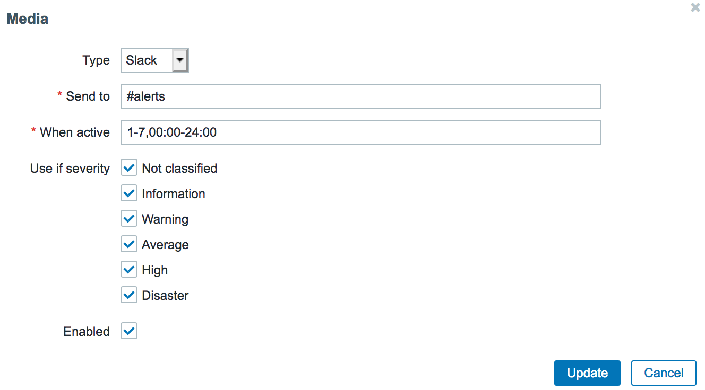
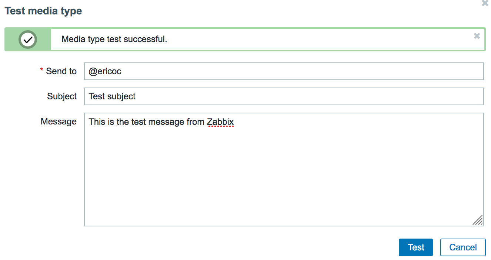
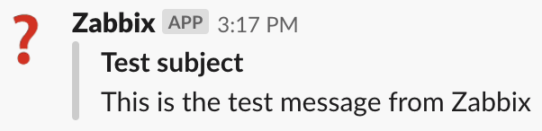

Zabbix Slack AlertScript
========================

About
-----
This is simply a Bash script that uses the custom alert script functionality within [Zabbix](http://www.zabbix.com/) along with the incoming web-hook feature of [Slack](https://slack.com/).
I originally created this since I could not find any already existing/similar scripts at the time. This is [one of many](https://www.zabbix.com/integrations/slack) now.

#### Versions
This works with Zabbix 1.8 or greater - including 2.x and 3.x, as well as the newest 4.0 and 4.2 versions!

#### Thanks
Huge thanks and appreciation to every one who has submitted issues or pull requests including:

* [Paul Reeves](https://github.com/pdareeves/) for the hint that Slack changed their API/URLs!
* [Igor Shishkin](https://github.com/teran) for the ability to message users as well as channels!
* Leslie at AspirationHosting for confirming that this script worked on Zabbix 1.8.2!
* [Hiromu Yakura](https://github.com/hiromu) for escaping quotation marks in the fields received from Zabbix to have valid JSON!
* [Devlin Gonçalves](https://github.com/devlinrcg), [tkdywc](https://github.com/tkdywc), [damaarten](https://github.com/damaarten), and [lunchables](https://github.com/lunchables) for Zabbix 3.0 AlertScript documentation, suggestions and testing!

Installation
------------

### The script itself

This [`slack.sh` script](slack.sh) needs to be placed in the `AlertScriptsPath` directory that is specified within the Zabbix servers' configuration file (`zabbix_server.conf`) and must be executable by the user running the zabbix_server binary (usually "zabbix") on the Zabbix server:

	[root@zabbix ~]# grep AlertScriptsPath /etc/zabbix/zabbix_server.conf
	### Option: AlertScriptsPath
	AlertScriptsPath=/usr/local/share/zabbix/alertscripts

	[root@zabbix ~]# ls -lh /usr/local/share/zabbix/alertscripts/slack.sh
	-rwxr-xr-x 1 root root 1.4K Dec 27 13:48 /usr/local/share/zabbix/alertscripts/slack.sh

If you do change `AlertScriptsPath` (or any other values) within `zabbix_server.conf`, a restart of the Zabbix server software is required.

Configuration
-------------

### Slack.com web-hook

An incoming web-hook integration must be created within your Slack.com account which can be done at [https://my.slack.com/services/new/incoming-webhook](https://my.slack.com/services/new/incoming-webhook) as shown below:

Given the above screenshot, the incoming Slack.com web-hook URL would be:

	https://hooks.slack.com/services/QW3R7Y/D34DC0D3/BCADFGabcDEF123
	
Make sure that you specify your correct Slack.com incoming web-hook URL and feel free to edit the sender user name at the top of the script:

	# Slack incoming web-hook URL and user name
	url='https://hooks.slack.com/services/QW3R7Y/D34DC0D3/BCADFGabcDEF123'
	username='Zabbix'

### Within the Zabbix web interface

When logged in to the Zabbix servers web interface with super-administrator privileges, navigate to the "Administration" tab, access the "Media Types" sub-tab, and click the "Create media type" button.

You need to create a media type as follows:

* **Name**: Slack
* **Type**: Script
* **Script name**: slack.sh

...and ensure that it is enabled before clicking "Save", like so:

However, on Zabbix 3.x and greater (including 4.x), media types are configured slightly differently and you must explicity define the parameters sent to the `slack.sh` script. On Zabbix 3.x and 4.x, three script parameters should be added as follows:

* `{ALERT.SENDTO}`
* `{ALERT.SUBJECT}`
* `{ALERT.MESSAGE}`

...as shown here:

An optional 4th script parameter can be added to over-ride the `url` hard-coded in the `slack.sh` script with the Slack.com incoming web-hook URL. This makes it possible to reuse the script for a different user or group to be alerted in a seperate slack environment.
An optional 5th script parameter can be added for proxy support. You can supply a `host:port` parameter (such as `example.com:8080`) that will be used when connecting to the Slack.com web-hook URL.

Then, create a "Slack" user on the "Users" sub-tab of the "Administration" tab within the Zabbix servers web interface and specify this users "Media" as the "Slack" media type that was just created with the Slack.com channel ("#alerts" in the example) or user name (such as "@ericoc") that you want messages to go to in the "Send to" field as seen below:

Finally, an action can then be created on the "Actions" sub-tab of the "Configuration" tab within the Zabbix servers web interface to notify the Zabbix "Slack" user.
You can stick with the default subject and message text for your problem (and optional recovery) operations.

Additionally, you can have multiple different Zabbix users each with "Slack" media types that notify unique Slack users or channels upon different triggered Zabbix actions.

If you are interesting in longer notification messages (with line breaks for example), you may want to reference [this pull request](https://github.com/ericoc/zabbix-slack-alertscript/pull/16) or [any number of forks of this repository](https://github.com/ericoc/zabbix-slack-alertscript/network).

Testing
-------

The new [Testing media types](https://www.zabbix.com/documentation/4.2/manual/web_interface/frontend_sections/administration/mediatypes#testing_media_types) feature within Zabbix 4.2 should allow you to test sending messages to Slack:

Alternatively, you can execute the script manually (as opposed to via Zabbix) from Bash on a terminal:

	$ bash slack.sh '@ericoc' 'Problem: This is a test' 'This is a test of something being wrong!'

Alerting a specific user name results in the message actually coming from the "Slackbot" user using a sort-of "spoofed" user name within the message. A channel alert is sent as you would normally expect from whatever user name you specify in `slack.sh`:

More Information
----------------
* [Slack incoming web-hook functionality](https://my.slack.com/services/new/incoming-webhook)
* [Zabbix custom alertscripts documentation](https://www.zabbix.com/documentation/current/manual/config/notifications/media/script)
